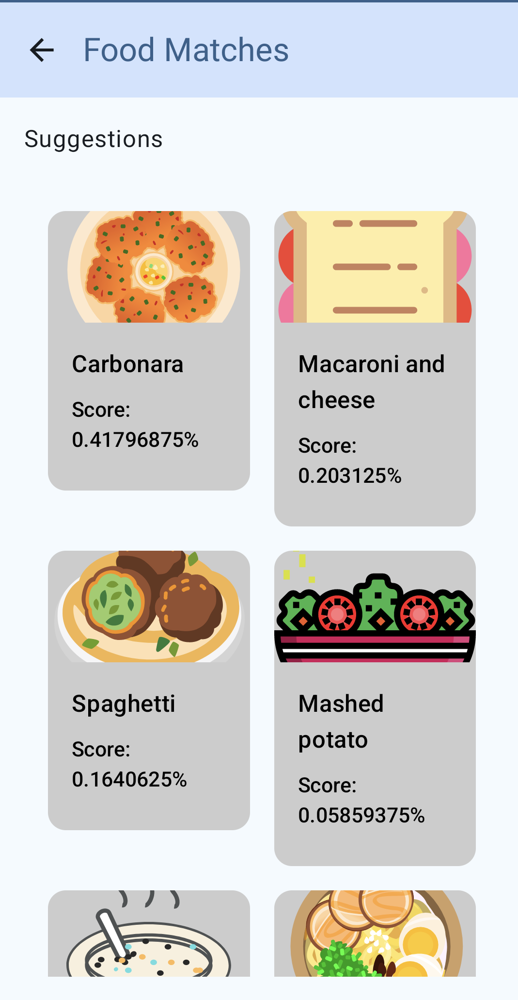

# What's in my thattu

**What's in my thattu** is a fully functional Android app built entirely with Kotlin and Jetpack Compose.
Thattu means Plate in Tamil Language

# Screenshots

  
  

What's in my thattu is an app which shows you the suggestions for the food items based on the images that you can either click using camera or select from gallery.
The Suggestions shown as a result from the ML Model are not 100 percent accurate

# Acknowledgements

The app uses this [ML model](https://www.kaggle.com/models/google/aiy/tensorFlow1/vision-classifier-food-v1/1?tfhub-redirect=true)
for image interpretation, Please check the link attached to know further about the model.

The icons used in this app are from [SVG Repo](https://www.svgrepo.com) , The Icons shown in the UI are randomized images added only for representational purpose.

This app uses Jetpack compose for UI, Hilt for Dependency Injection, Coil for Image rendering and Tensor flow lite for ML model
